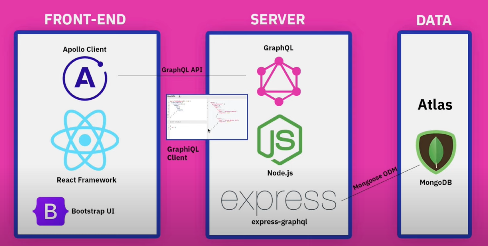

# GraphQL Crash Course With Full Stack MERN Project


## Source
GraphQL Crash Course With Full Stack MERN Project from Traversy Media.
https://www.youtube.com/watch?v=BcLNfwF04Kw
https://github.com/bradtraversy/project-mgmt-graphql

## Stack

### Express - Graphql
https://graphql.org/graphql-js/running-an-express-graphql-server/


## Links
[Github repository](git@github.com:thedivloop/graphql-mern.git)

## Supporting bits

### Problems

In the MONGO_URI the special characters in the password have to be URL encoded, [check this out](https://www.mongodb.com/docs/atlas/troubleshoot-connection/#special-characters-in-connection-string-password).


### Git - Github
https://www.theserverside.com/video/How-to-use-the-git-remote-add-origin-command-to-push-remotely
https://www.git-tower.com/learn/git/faq/git-rename-master-to-main

Rename local branch
```
git branch -m master main
```

Add origin URL
```
git remote add origin URL
```
Initial push 
```
git push --set-upstream origin main
```

Force your local repo to github if any problem (this will overwrite your github repo content!!)
```bash
git push origin main --force
```

## Credits
As usual a Huge Thank you to Brad for his top notch content!

[His Youtube channel](https://www.youtube.com/c/TraversyMedia) 